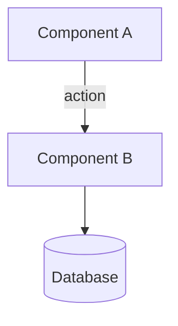
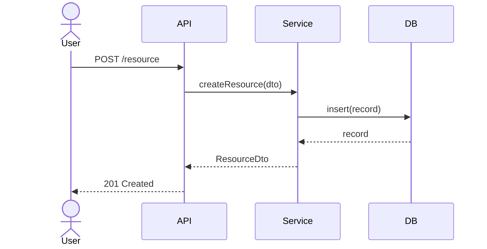

# Architecture Writer Skill

This skill defines the exact template and quality rules for all
`docs/<feature>/architecture.md` files in this project.

The document you produce is the direct input to the next workflow stage:
breaking the design into implementation phases and tasks (`/plan`).
Write with that consumer in mind — every phase must be self-contained enough
that a task-planning agent can operate on it independently.

---

## Document template

Use this section order exactly. Never remove a section; write "N/A — [reason]"
if a section genuinely does not apply.

```markdown
# Architecture: <Feature Name>

> **Status**: Draft | Review | Approved
> **Requirements doc**: [docs/<feature>/requirements.md](./requirements.md)
> **Created**: YYYY-MM-DD
> **Last updated**: YYYY-MM-DD
> **Feature slug**: <kebab-case-name>

---

## 1. Overview

Two to four sentences: what this architecture delivers, what it integrates with,
and the dominant structural approach (e.g. "extends the existing REST API layer
using the established repository pattern; no new infrastructure required").

---

## 2. Architecture Context

### 2.1 Codebase findings

Key patterns, modules, and conventions discovered during exploration that
directly shape this design. Be specific — include file paths.

- **Tech stack**: list languages, frameworks, runtime
- **Relevant existing modules**: `src/…` paths and what they do
- **Data access pattern**: ORM / raw SQL / repository / etc.
- **API style**: REST / GraphQL / RPC / tRPC / etc.
- **Test infrastructure**: test runner, fixtures approach, coverage tooling
- **Build & deploy**: bundler, CI config, deployment target

### 2.2 Design constraints

Hard limits inherited from the codebase or requirements:

- Constraint 1 (source: FR-N or codebase)
- Constraint 2

### 2.3 Assumptions

Assumptions made while designing. Each must be validated before Phase 1 begins.

- Assumed X because Y
- Assumed the existing `<module>` supports Z without modification

---

## 3. System Design

### 3.1 Component diagram

Use Mermaid. Show all new and significantly modified components and their
relationships. Include external systems and data stores.



### 3.2 Component responsibilities

For each new or modified component:

| Component | Location | Responsibility | New / Modified |
|-----------|----------|----------------|----------------|
| `FeatureService` | `src/features/<feature>/service.ts` | Business logic layer | New |
| `UserRepository` | `src/repositories/user.ts` | Data access for users | Modified |

### 3.3 Data flow

Describe the primary data flow for the most important user story end-to-end.
Use a Mermaid sequence diagram.



---

## 4. Data Architecture

### 4.1 Schema changes

List every new table, column, index, or constraint. If using an ORM, show the
model definition style consistent with the existing codebase.

| Table / Model | Change | Fields added / modified |
|---------------|--------|------------------------|
| `users` | Modified | `+ email_verified_at: timestamp nullable` |
| `sessions` | New | `id, user_id, token, expires_at, created_at` |

If no schema changes: "No schema changes required."

### 4.2 Migration strategy

- How will existing data be migrated (if applicable)?
- Is the migration reversible (down migration)?
- Any zero-downtime considerations?

### 4.3 Data access patterns

For each major query or write path, describe:
- What is queried / written
- Indexes required
- Expected volume and frequency

---

## 5. API Design

### 5.1 New endpoints / mutations

For each new API surface:

```
METHOD /path/to/endpoint

Request:
{
  "field": "type — description"
}

Response 200:
{
  "field": "type — description"
}

Error responses:
- 400: validation failure — { "error": "message" }
- 401: unauthenticated
- 403: insufficient permissions
- 404: resource not found
```

If no API changes: "No API surface changes required."

### 5.2 Modified endpoints

Describe changes to existing endpoints. Note backward-compatibility impact.

---

## 6. Security Architecture

Derived from the requirements' security considerations. Address each point even
if the answer is "handled by existing middleware."

- **Authentication**: how is the caller's identity verified?
- **Authorization**: what permission checks are applied, and where?
- **Input validation**: where is validation performed? what library?
- **Sensitive data**: what data is sensitive, how is it stored and transmitted?
- **Rate limiting**: is any new endpoint or operation rate-limited?
- **Audit logging**: what events must be logged for audit purposes?

---

## 7. Error Handling Strategy

- How are errors propagated from data layer → service layer → API layer?
- What error types / codes are used? (Align with existing patterns)
- What should be logged vs returned to the caller?
- What is the retry/fallback strategy for external dependencies?

---

## 8. Testing Strategy

Align with the project's existing test infrastructure.

| Layer | What to test | Tool | Notes |
|-------|-------------|------|-------|
| Unit | Service logic, validators | — | Mock repositories |
| Integration | Repository ↔ DB | — | Use test DB |
| API / E2E | Critical user flows | — | Seed fixtures |

List the minimum test scenarios that must pass before each phase ships.

---

## 9. Implementation Phases

Decompose the full design into 2–4 sequential phases.

**Phase rules (enforced):**
- Phase 1 must deliver a working, observable vertical slice of user value
- No phase may require rework of a prior phase's output
- Each phase is independently deployable and testable
- Phase N's "Entry criteria" must equal Phase N-1's "Exit criteria"

---

### Phase 1: <Name — one user story end-to-end>

**Goal**: [One sentence stating the user-visible outcome of this phase]

**Entry criteria**: [What must be true before this phase begins]

**In scope**:
- Deliverable 1 (maps to FR-N)
- Deliverable 2 (maps to FR-N)

**Out of scope for this phase**:
- Capability X (deferred to Phase 2)

**Key files to create or modify**:
| Action | Path | Description |
|--------|------|-------------|
| Create | `src/…` | … |
| Modify | `src/…` | … |

**Exit criteria / acceptance test**:
- [ ] Given [setup], when [action], then [outcome] — verifiable by running `<test command>`
- [ ] Given [setup], when [action], then [outcome]

---

### Phase 2: <Name>

*(same structure as Phase 1)*

---

### Phase 3: <Name — if needed>

*(same structure as Phase 1)*

---

## 10. Architectural Decision Records (ADRs)

Document every significant non-obvious decision. One entry per decision.

### ADR-1: <Decision title>

- **Status**: Accepted
- **Decision**: [What was chosen]
- **Rationale**: [Why this over alternatives]
- **Trade-offs**: [What is given up]
- **Alternatives considered**:
  - *Alternative A*: [description — why rejected]
  - *Alternative B*: [description — why rejected]

---

## 11. Open Questions

Must be resolved before Phase 1 begins unless noted otherwise.

| # | Question | Needed before | Owner |
|---|----------|--------------|-------|
| Q-1 | | Phase 1 | TBD |

If no open questions: "No open questions. Ready for Phase 1."

---

## 12. References

- [Requirements document](./requirements.md)
- Any other docs, RFCs, or external references
```

---

## Formatting rules

1. **Feature slug** in the H1 and frontmatter must exactly match `docs/<slug>/`.
2. **Status** starts as `Draft`. Only a human changes it to `Review` or `Approved`.
3. **All diagrams** must use Mermaid fenced code blocks (` ```mermaid `).
4. **Phase names** must be short (3–6 words) and describe the user-visible outcome,
   not the technical task (e.g. "User can log in via email" not "Implement auth endpoints").
5. **FR references** (FR-1, FR-2 …) must match IDs in the linked requirements doc.
6. **ADR IDs** are sequential: ADR-1, ADR-2 … At least one ADR is required.
7. **Exit criteria** for each phase must be expressed as Given/When/Then statements
   that can be verified by running a specific command or manual test.
8. The document must end with `## 12. References` followed by a trailing newline.

---

## Quality checklist

Before writing the file, verify:

- [ ] Every P0 and P1 requirement from the requirements doc appears in at least one phase
- [ ] Phase 1 is a vertical slice (UI + API + DB + test), not a "foundation" phase
- [ ] No phase requires rework of a prior phase
- [ ] At least one Mermaid component diagram and one sequence diagram present
- [ ] Every ADR has at least one "alternative considered"
- [ ] Schema changes table is present (or explicitly marked N/A)
- [ ] All new API endpoints have request/response shapes documented
- [ ] Open Questions section is present and non-empty if any ambiguity remains
- [ ] File saved to `docs/<feature-slug>/architecture.md`

---

## Relationship to other workflow documents

| Document | Location | Status when this doc is written |
|----------|----------|----------------------------------|
| Requirements | `docs/<feature>/requirements.md` | In Review or Approved |
| **This document** | `docs/<feature>/architecture.md` | Draft |
| Phase plan (next) | `docs/<feature>/phases.md` | Does not exist yet |

The `phases.md` document (produced by the `/plan` command) will consume
`## 9. Implementation Phases` from this document as its primary input.
Write that section with enough detail that a task-breakdown agent needs
no additional context beyond what appears in phases 9 and the component table.
